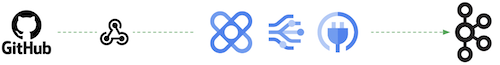
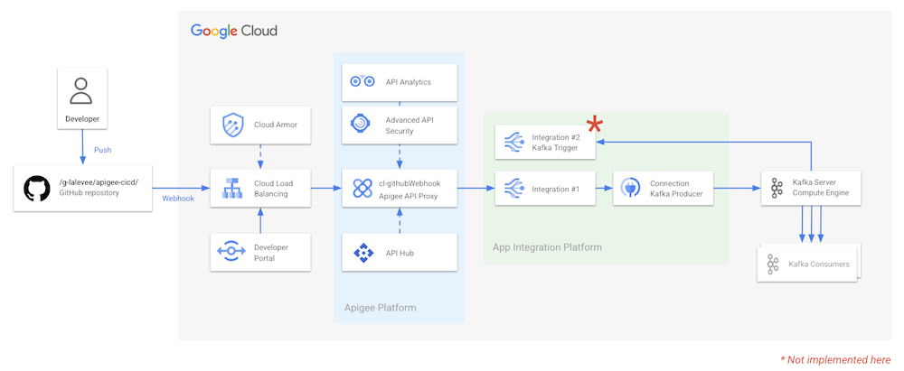
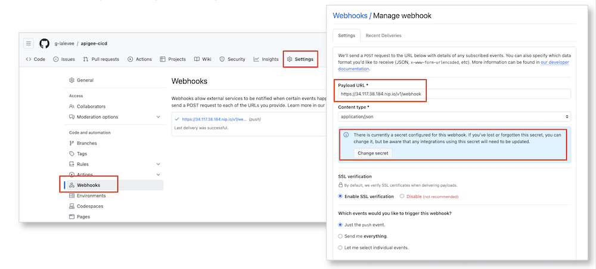
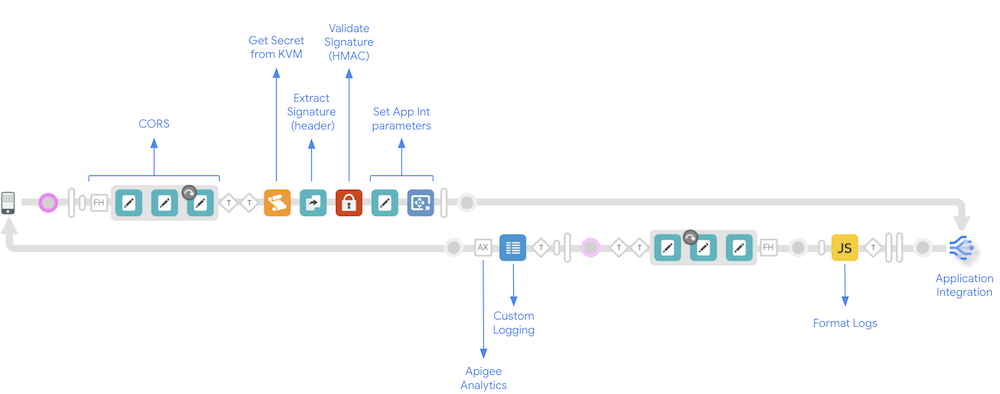
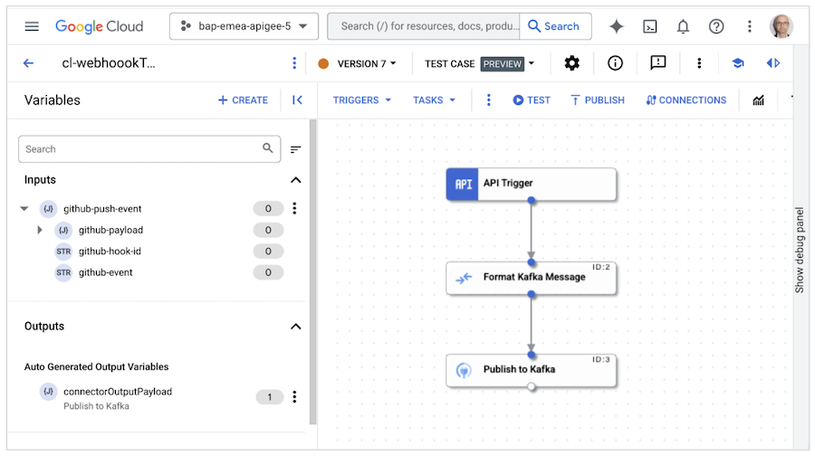
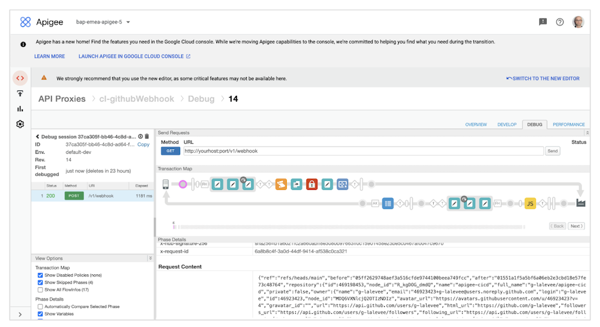
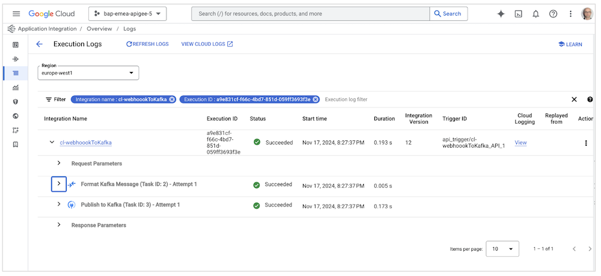

# Apigee & Application Integration Kafka Webhook

 

**This is not an official Google product.** This implementation is not an official Google product, nor is it part of an official Google product. Support is available on a best-effort basis via GitHub.

***

This repository provides a solution for integrating GitHub webhook events with a Kafka topic via Google Apigee and Google Cloud Application Integration. 

It allows you to securely receive webhook notifications from GitHub and seamlessly forward them to Kafka for further processing or analysis.

## Use Case: GitHub Webhook

This integration focuses on handling GitHub webhook events. It enables you to capture events like:

* **Push:** Code pushes to a repository.
* **Pull Request:** Creation, updates, and merges of pull requests.
* **Issues:** Creation, modification, and closure of issues.
* **And more:**  A wide range of other GitHub events.

These events are securely received by an Apigee endpoint and then relayed to a Kafka topic.

## Architecture

The integration follows this flow:

[GitHub] --> [Apigee Secured Webhook Endpoint] --> [Application Integration] --> [Kafka Connector] --> [Kafka Topic]

## Components

* **Apigee:**  Acts as the secure entry point for GitHub webhooks, providing authentication and authorization.
* **Application Integration:** Google Cloud's service for connecting to various backend systems, including Kafka.
* **Integration Connector:** Enables Application Integration to publish messages to a Kafka topic.
* **Kafka Topic:** The destination where GitHub events are stored for consumption. Hosted in your Kafka server.

## Prerequisites

* Google Cloud Account: You must have valid Google Cloud accounts and associated roles to configure both Apigee and Integration
* `apigeecli`: Installation instructions: [apigeecli](https://github.com/apigee/apigeecli)
* `integrationcli`: Installation instructions: [application-integration-management-toolkit](https://github.com/GoogleCloudPlatform/application-integration-management-toolkit)

## Code Structure

* `apiproxy/`:  Contains the Apigee proxy configuration (proxies, policies, resources).
* `integration/`:  Holds the Application Integration configuration files.
* `install.sh/`:  Scripts for deployment of proxy and integration.

## Setup and Configuration

### 1. GitHub
* **Create a webhook:** In your GitHub repository settings, add a new webhook.
* **Set the Payload URL:** Point it to your secured Apigee endpoint. Format is `<YOUR-APIGEE-HOSTNAME>/v1/webhook`
* **Select events:** Choose the specific events you want to receive.
* **Content type:** Set to `application/json`.
* **Secret:**  Configure a secret for HMAC verification to enhance security (it will be store later into Apigee KVM).

### 2. Integration Connector
* **Create and configure the connector:** Provide Kafka broker address, topic name, authentication details, and other necessary settings. See [Apache Kafka Connector Documentation.](https://cloud.google.com/integration-connectors/docs/connectors/apachekafka/configure)

### 3. GCP

* Create a Google service account in the same Google Cloud project where your Apigee organization was created, and do the following:
  * Assign the Application Integration Invoker role (`roles/integrations.applicationIntegrationInvokerRole`) to the service account.
  * Allow your user account (principal) to attach service accounts to resources with the `iam.serviceAccounts.actAs` permission. 

  You must provide this service account when you deploy the API proxy (next step).

* The proxy provided sends logs to Cloud Logging (Log name: apigee). This requires that the service account has also `roles/logging.logWriter` role. Add the role to the service account created or remove the ML-sendLogsCloudLogging policy in the proxy flow.

### 4. Apigee & Application Integration
* Set variable values in install.sh file:
  * **project** = name of the GCP project hosing both Apigee and Application Integration instances
  * **region** = GCP region to deploy the integration 
  * **env** = Apigee environment name to deploy proxy
  * **github_secret** = GitHub webhook secret to be store in Apigee KVM (created step #1)
  * **apigee_deployment_sa** = GCP Servce Account used by Apigee proxy to access to Application Integration and Cloud Logging (created step #3)

* Update Application Integration Configuration Variable file: `./integration/config-variables/config.json`
  * Set variables values:
    * **CONFIG_ConnectionName**: the name of the Kafka connection created in step #2 (format: `projects/<PROJECT_NAME>/locations/<REGION>/connections/<CONNECTION_NAME>`
	* **CONFIG_channel**: the name of the Kafka target topic

## Deployment

* Run Bash script file `install.sh`
* Et voilà !

## Test

* Update a file your GitHub repository
* Check the Apigee trace or the log file in Google Cloud Log Explorer

* Check the Application Integration Log in Application Integration (you can also activate Cloud Logging for this iintegration)

